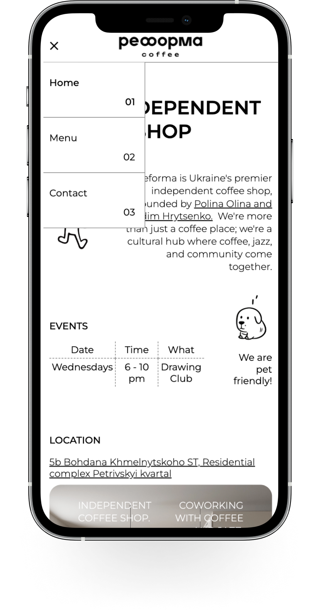

# Reforma-landing-page
Responsive landing page for 'Reforma' coffee place with an integrated Hoffmann coffee calculator.

## Table of Contents

- [UI Screenshot](#ui-screenshot)
- [Introduction](#introduction)
- [Technologies](#technologies)
- [Installation](#installation)
- [Find a Bug?](#find-a-bug)
- [Known Issues](#known-issues-work-in-progress)
- [Other Information](#other-information)

## UI Screenshot 

## Technologies
This project was scaffoldede with [Vite plugin](https://vitejs.dev) for React.
Deployed on [Netlify](https://www.netlify.com).

  

## Find a bug? 

If you encounter any issues or would like to submit an improvement to this project, please don't hesitate to create an issue using the "Issues" tab above!

## Known issues (Work in Progress)

<!-- Reforma coffee landing page + Hoffmann coffee calculator. Build on React + Firebase to collect google subscription + EmailJS + Image Changer + Create Loading Page -->